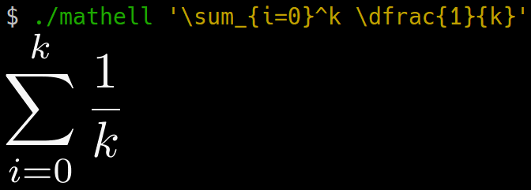

# mathell
Print a mathematical expression given in latex style.

## Example
`./mathell '\sum_{i=0}^k \dfrac{1}{k}'`

## Note
Now the implementation is very naive.
Internal errors are not checked and the input is not sanitized.

## Dependencies
- lualatex
- pdfcrop
- pdftoppm
- convert (imagemagick)
- img2sixel
